# Chapter 4. Numerical Result

## 4.1 Overview

This chapter reports the experiments defined in Chapter 3. Section 4.2 characterizes the
datasets; Section 4.3 establishes baseline and loss-function behavior in-domain and justifies
why the in-domain analysis is anchored on CMOSE; Section 4.4 is the core semantic-group hybrid
ablation; Section 4.5 is the cross-dataset generalization study; Section 4.6 — the practically
most important result — evaluates generalization to the **self-collected private set**;
Section 4.7 is error analysis. Unless stated, "in-domain" means trained and tested on the same
corpus, and the primary metrics are **QWK** and **macro-accuracy**. All figures are in
`outputs/thesis/figures/` and all tables in `outputs/thesis/tables/`.

## 4.2 Dataset Analysis

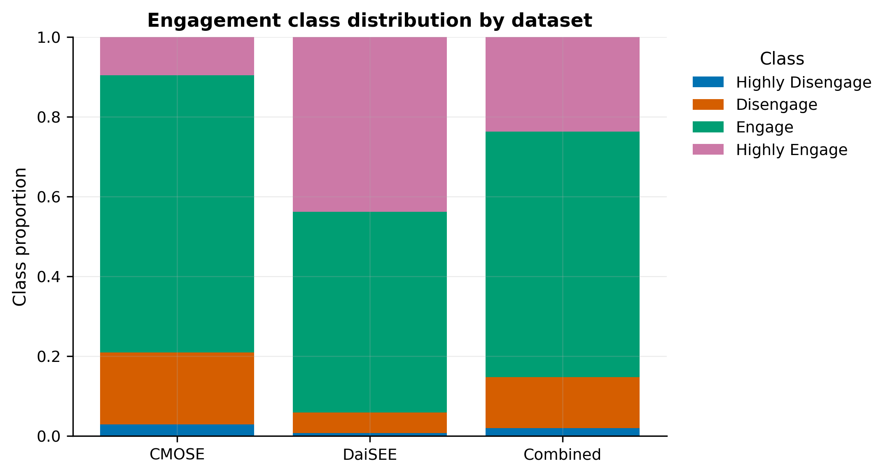

*Table T1* and the figure above show that all three corpora are heavily imbalanced toward the
upper-middle classes, and in *different directions*: CMOSE is 69.4% Engage with only 2.8%
Highly-Disengage, whereas DAiSEE has 50.3% Engage **and 43.8% Highly-Engage** with just 0.7%
Highly-Disengage. The rare disengaged classes are precisely the ones a useful system must
catch. This mismatch in label priors already predicts difficulty when transferring between
corpora (Section 4.5) and motivates the imbalance-aware losses.

## 4.3 Base Models and Loss Functions (In-Domain)

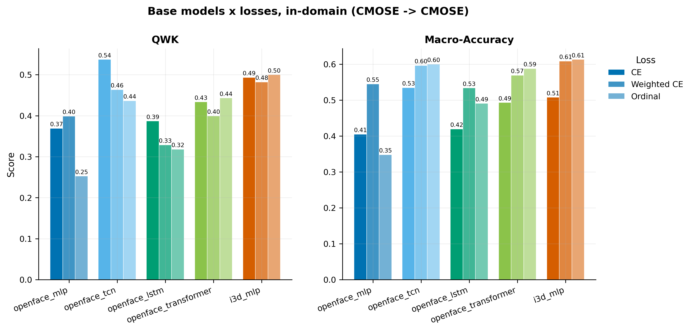

Among the five monolithic baselines (*Table T2*), the **OpenFace TCN with cross-entropy** is
the strongest on ordinal agreement: **QWK 0.537**, accuracy 0.761. The I3D MLP attains the
highest *raw accuracy* (0.764) but a lower QWK (0.493) and macro-accuracy (0.508) under CE —
i.e. it wins accuracy by leaning on the majority class. The TCN's local temporal bias edges out
LSTM, Transformer, and the flat MLP. **This QWK of 0.537 is the bar the hybrid must clear.**

**The loss tradeoff.** Figure `loss_accuracy_tradeoff` makes the accuracy-vs-balance tension
explicit:

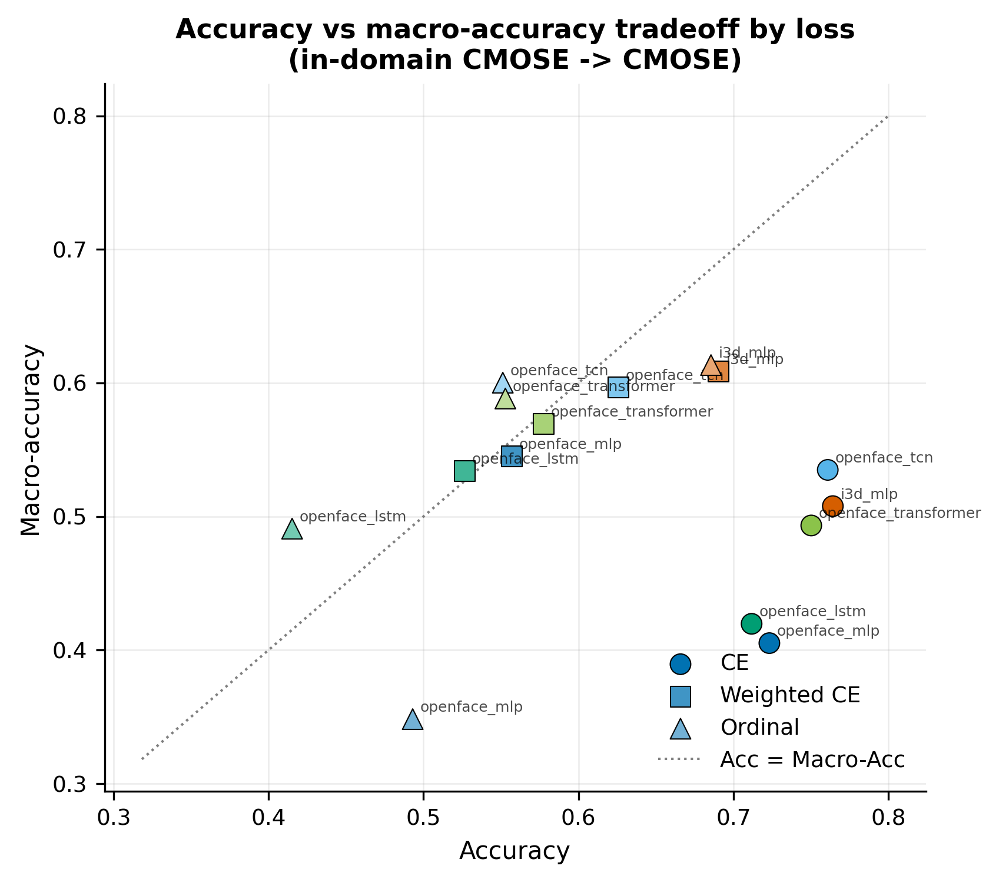

Cross-entropy points sit in the lower-right (high accuracy, low macro-accuracy); weighted-CE
and ordinal points move up-and-left (more balanced, less accurate). For the I3D MLP, switching
CE→Ordinal moves (acc 0.764, macro 0.508) → (0.686, 0.613). There is no universally best loss;
it is a Pareto choice, and for engagement monitoring — where missing disengagement is costly —
the balanced losses are defensible despite lower headline accuracy.

Figure `loss_curves_cmose_ce` confirms all baselines train stably and early-stop well before
the cap, so the differences above are architectural, not optimization artifacts.

**Why CMOSE for the in-domain analysis?** The in-domain comparison above, and the architecture
ablation in Section 4.4, are conducted on CMOSE rather than DAiSEE for a principled reason:
DAiSEE carries far weaker in-domain ordinal signal. *Table T7* and Figure
`indomain_cmose_vs_daisee` show that the best in-domain model reaches **QWK 0.537 on CMOSE but
only 0.139 on DAiSEE** (macro-accuracy 0.535 vs 0.273). On DAiSEE the best models barely exceed
chance-level ordinal agreement, so differences between architectures there would be dominated by
label noise rather than model quality. CMOSE is the only corpus on which architecture choices
can be compared meaningfully; we therefore *develop* on CMOSE and *validate generalization* on
DAiSEE and, decisively, on the private set (Sections 4.5–4.6).

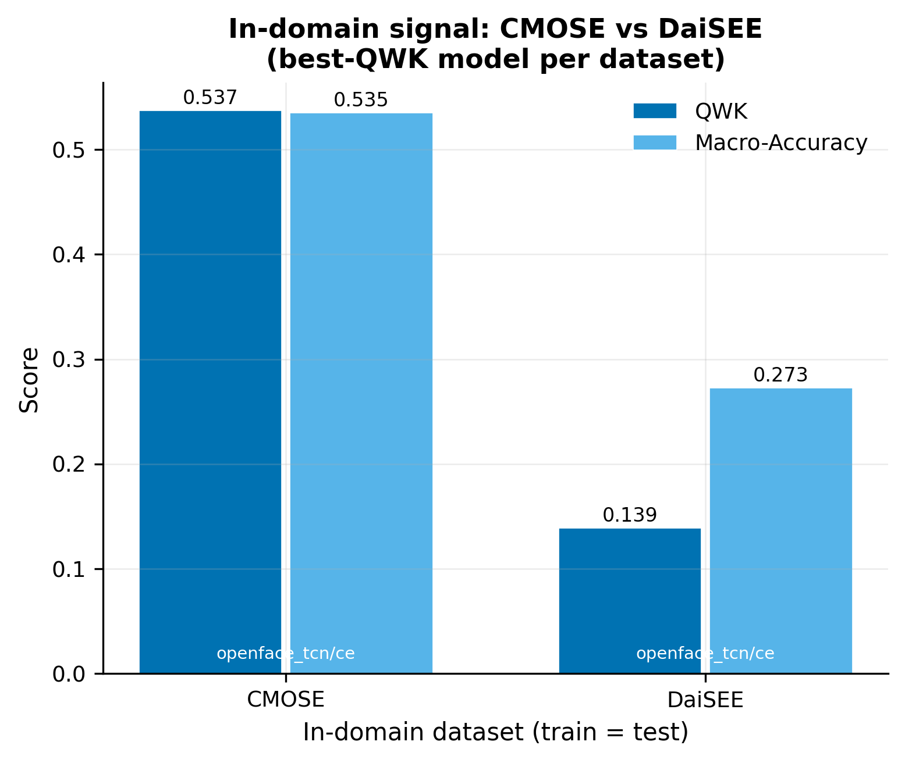

## 4.4 Semantic-Group Hybrid Ablation (Core Result)

**Does the hybrid beat the baseline, and how robustly?** Figure
`hybrid_ablation_distribution` plots the QWK of all 32 per-group encoder configurations, split
by whether the I3D stream is added, against the best-baseline line (0.537):

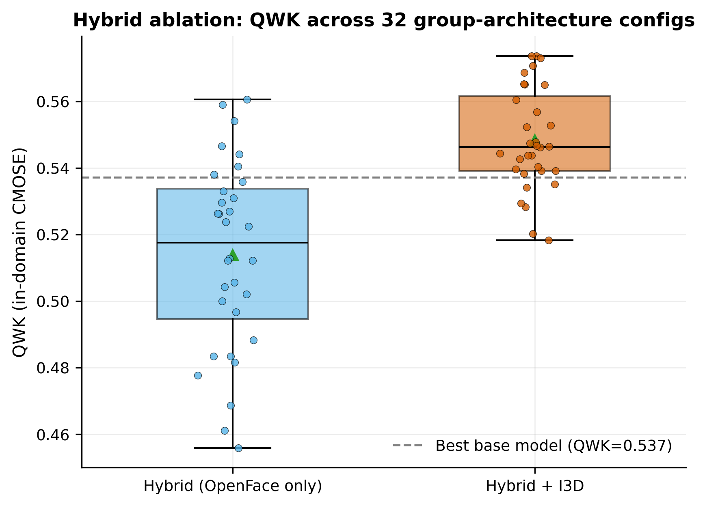

The **I3D-fused hybrid family sits almost entirely above the baseline** (median ≈ 0.547; best
0.574), whereas the **OpenFace-only hybrid straddles it** (median ≈ 0.518; best 0.561). The
key message is robustness: the I3D-fused advantage holds across *all* per-group assignments, so
the gain comes from the architecture family rather than from a single lucky configuration
(**RQ1, RQ3**). *Table T4* lists the top-10 configurations; the best overall is the all-TCN
I3D hybrid `TCN_TCN_TCN_TCN_TCN` (QWK 0.574, accuracy 0.776).

**Which group's encoder actually matters?** Figure `hybrid_group_marginal` and *Table T5* show
the mean QWK when each group uses a TCN versus a Transformer, marginalizing over all other
groups:

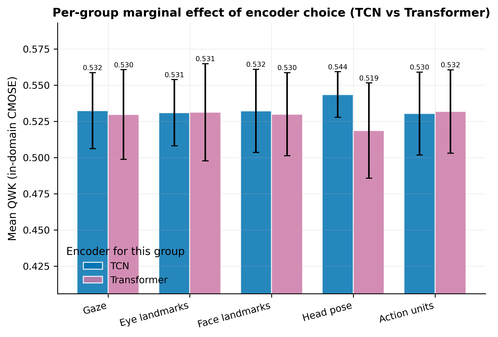

Only **head pose shows a clear preference — TCN over Transformer (0.544 vs 0.519, Δ = +0.025)**.
The other four groups are essentially encoder-agnostic (|Δ| ≤ 0.003). This is an interpretable
design rule: head dynamics (nodding, turning away) are temporally local and convolution-
friendly, while gaze/landmark/AU streams are insensitive to the encoder choice (**RQ2**). It
also honestly bounds the contribution — most of the 32-config grid is flat.

**Best hybrid vs best baseline.** Figure `hybrid_best_comparison` summarizes the headline
comparison: the best hybrid+I3D improves on the best baseline by **+0.037 QWK** (0.574 vs
0.537) and +1.5 points accuracy. The gain is real but **incremental**; the contribution of this
thesis is the decomposition framework and its systematic evaluation, not a large jump in SOTA.

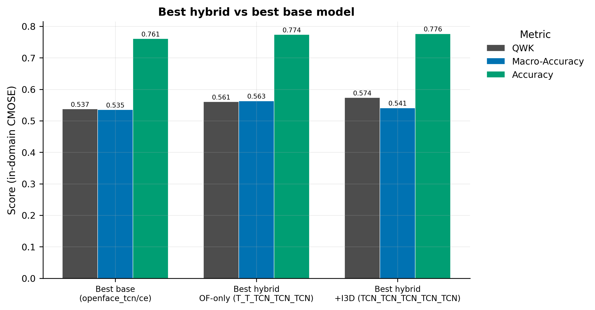

## 4.5 Cross-Dataset Generalization

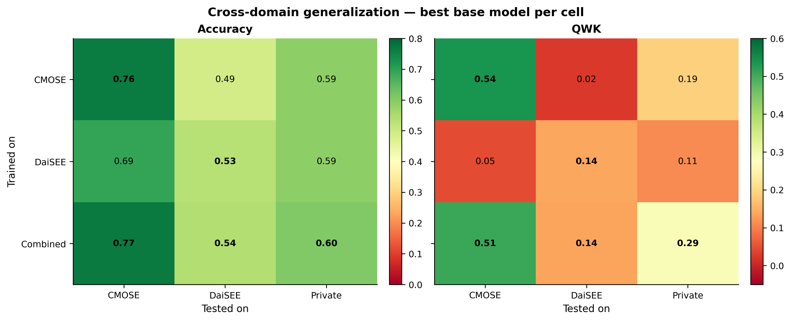

The 3×3 heatmaps (and *Table T3*) are the second headline result. **On the diagonal**
(train and test on the same corpus) QWK is healthy (CMOSE 0.54). **Off the diagonal it
collapses**: CMOSE→DAiSEE QWK = 0.02 and DAiSEE→CMOSE = 0.05 — essentially chance-level ordinal
agreement. Crucially, **raw accuracy hides this**: CMOSE→DAiSEE accuracy is a deceptively
reasonable 0.49 and DAiSEE→CMOSE 0.69, purely because predicting the majority class scores well
on imbalanced targets. This is direct evidence that **accuracy is the wrong metric** for this
problem and that engagement models are **not portable off-the-shelf**.

The most actionable cell is the unseen **Private** column: training on the **Combined** corpus
gives the best private-set QWK (0.285), beating CMOSE-only (0.19) and DAiSEE-only (0.11).
Pooling source datasets is a simple, effective mitigation for an unknown target distribution
(**RQ4**). The hybrid heatmap (`crossdomain_hybrid`) shows the same pattern, confirming the gap
is a property of the problem, not of a particular architecture.

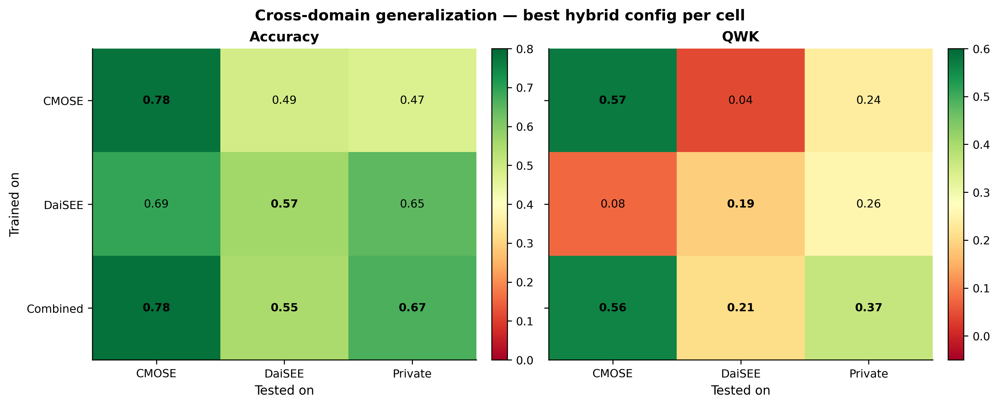

## 4.6 Private-Set Generalization: The Real-World Test

The most consequential evaluation in this thesis is on the **private set** — 366 clips that we
**collected and hand-labeled ourselves** (Section 3.2), processed through the identical
OpenFace/I3D pipeline, and used **for testing only**. Because no model is ever trained on it,
the private set is a genuine "in-the-wild" probe of deployment: it has its own recording
conditions and its own label prior (58% Engage, 31% Highly-Engage, only 2.7% Highly-Disengage).
For this set there is no in-domain option at all; the *only* design lever is the choice of
training source. This makes the private set the cleanest test of the two contributions of this
thesis acting together.

Figure `private_by_source` and *Table T6* report the best base model and the best
semantic-group hybrid on the private set, for each training source:

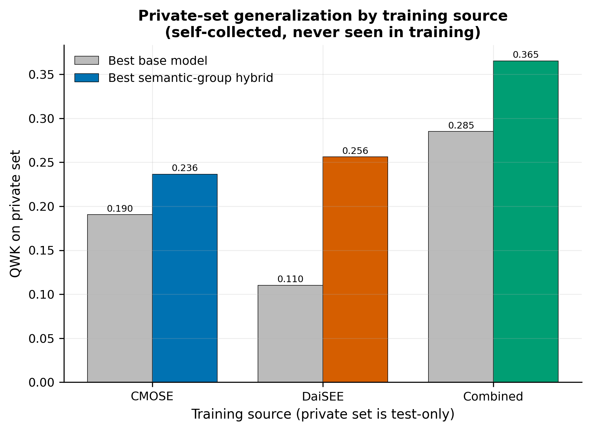

Two effects compound, and both favor this thesis's contributions:

1. **Training source matters, and the combined corpus wins.** For both model families, training
   on **Combined** generalizes best to the private set; a single source is markedly worse
   (best base QWK: Combined 0.285 vs CMOSE 0.190 vs DAiSEE 0.110). Pooling heterogeneous source
   corpora is the most effective simple route to an unseen target.
2. **The hybrid helps more here than in-domain.** The semantic-group hybrid beats the best base
   model for *every* training source, and the gap is **largest exactly where it matters** — on
   the private set under combined training the hybrid reaches **QWK 0.365 vs 0.285** for the
   best base, a **+0.080** improvement, more than double the +0.037 in-domain CMOSE gain
   (Section 4.4). The overall best private-set model is the combined-trained I3D-fused hybrid
   `T_T_T_T_TCN` (QWK 0.365, accuracy 0.596).

In other words, the architecture contribution and the combined-training insight are not
independent curiosities: they **stack**, and they stack most strongly on the hardest, most
realistic, self-collected target. This is the practical headline of the thesis.

Figure `private_confusion_combined` shows the row-normalized confusion of the **headline model
— the combined-trained I3D hybrid `T_T_T_T_TCN` (QWK 0.365)** — on the private set. The ordinal
structure is captured (mass concentrates on the diagonal and its neighbors): Engage recall is
0.69 and Highly-Engage 0.55, with errors mostly to adjacent classes. As in-domain, the rare
disengaged classes are the failure mode under shift — Disengage recall is only 0.26 and
**Highly-Disengage collapses to 0.00** (all 10 private HD clips are misread as DE/EG). This
confirms that the gains reported above are concentrated in the well-populated upper-engagement
region, and that recognizing rare disengagement on an unseen distribution is the central open
problem (Section 5.2).

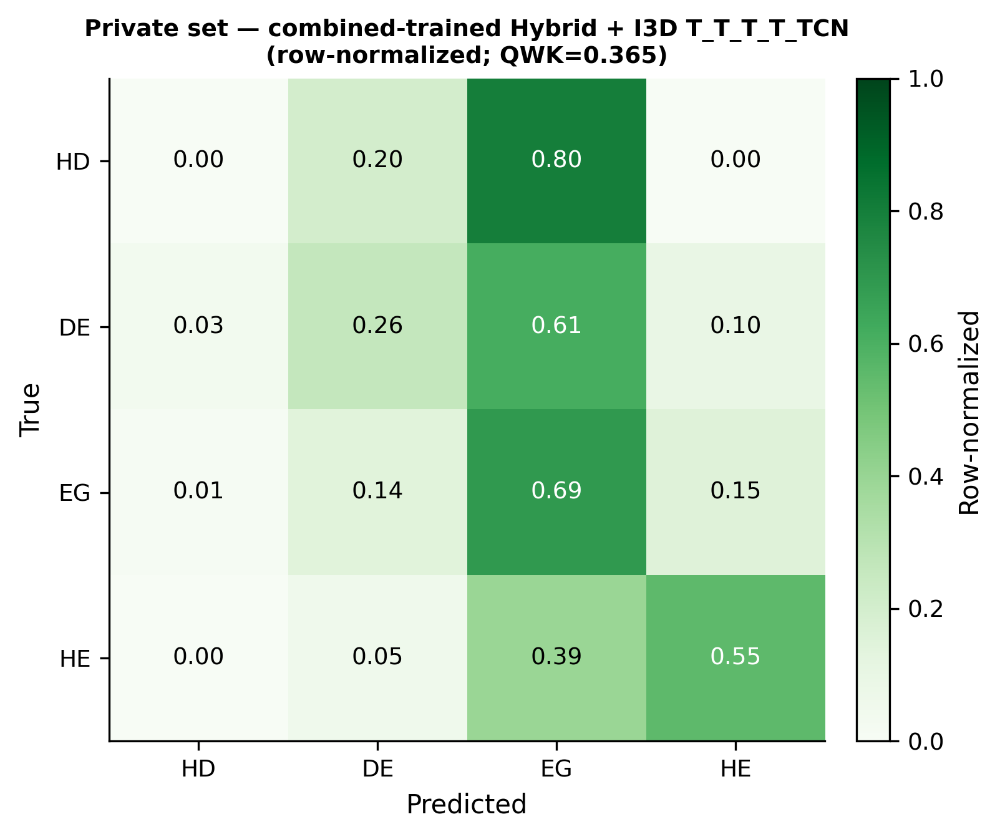

## 4.7 Error Analysis

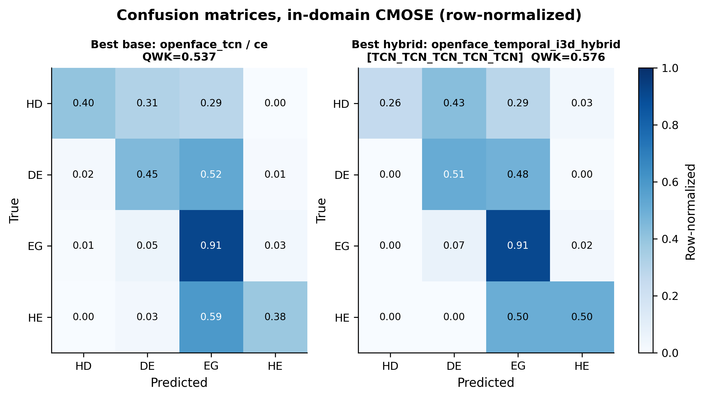

The row-normalized confusion matrices and per-class F1 (Figure `per_class_f1`) localize where
the hybrid helps and where the problem remains open. Relative to the best baseline, the hybrid
improves recall on the ordinal extreme **Highly-Engage (0.38 → 0.50)** and on **Disengage
(0.45 → 0.51)**, while keeping Engage at 0.91. However, the rarest class **Highly-Disengage**
stays unsolved and is even traded away (base recall 0.40 → hybrid 0.26): the model reallocates
capacity toward the more frequent extreme. The improvement is therefore real but **uneven**,
and the ~2–3%-frequency HD class is the principal open challenge.

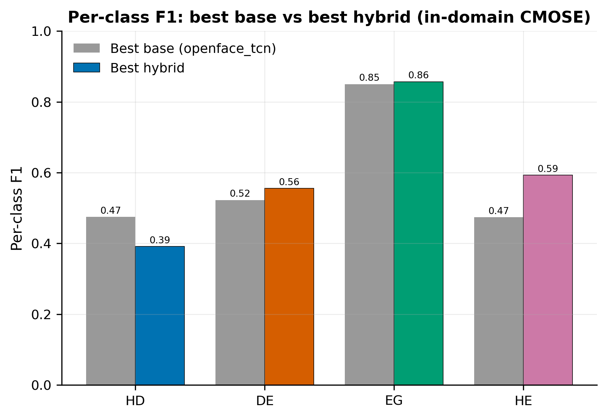

> TODO: paste the rendered Markdown tables (T1–T5) from `outputs/thesis/tables/` at the points
> referenced above, or `\input` the corresponding `.tex` files when typesetting in LaTeX.
