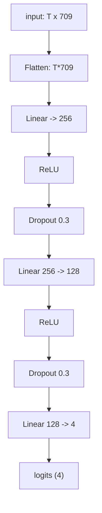
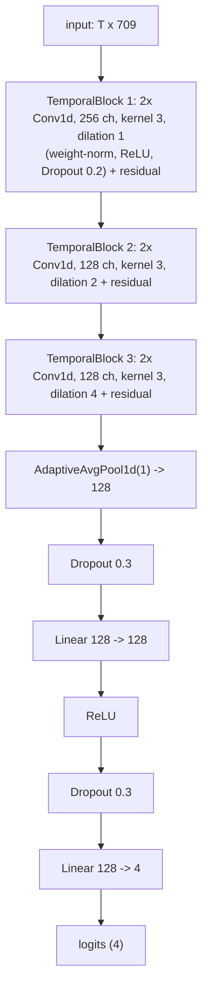
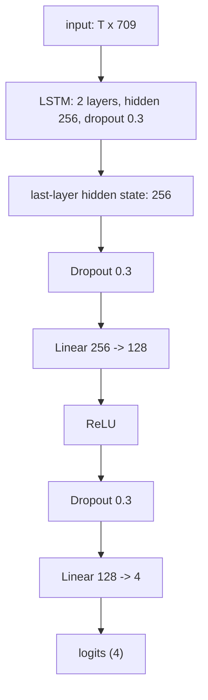
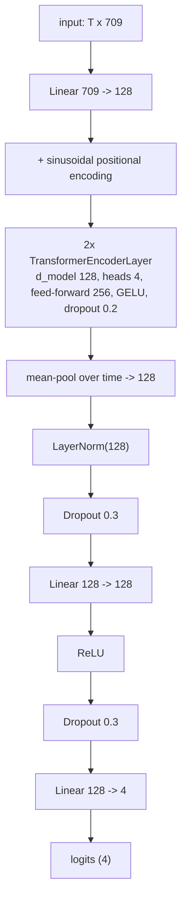
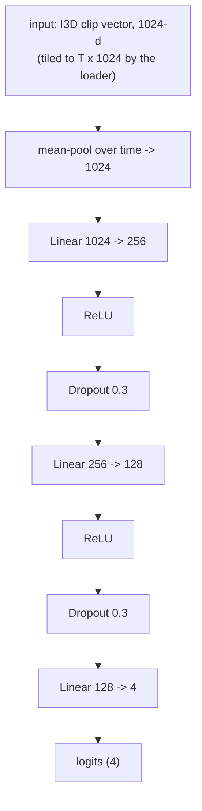
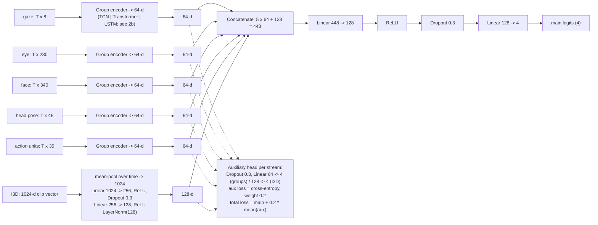
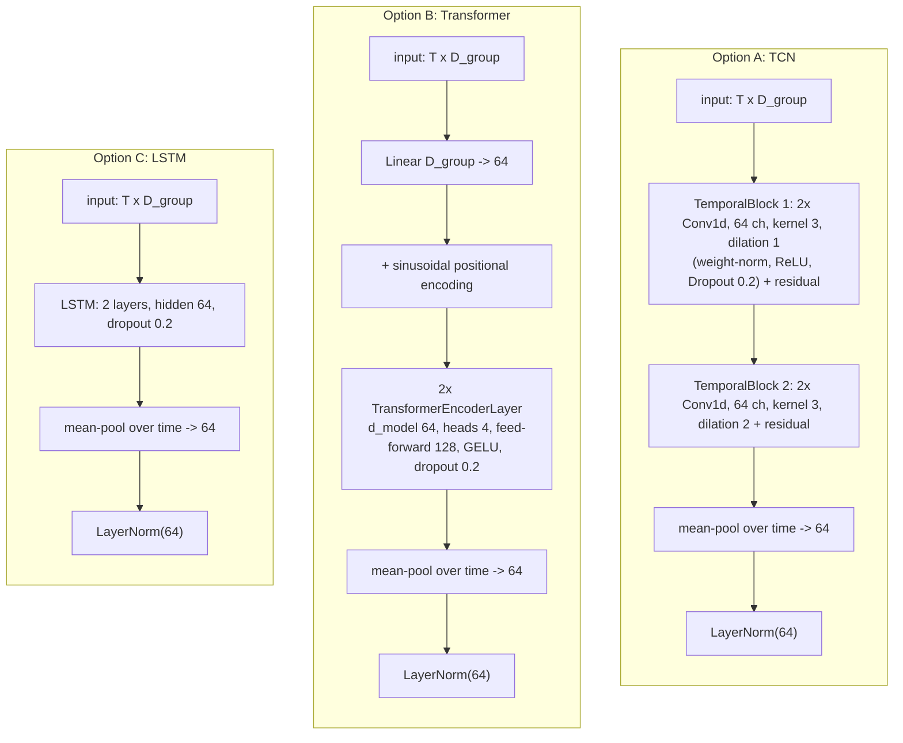

# Thesis architecture diagrams (Mermaid source for manual drawing)

Reference for the Chapter 3 architecture figures: the monolithic **baselines** and the proposed
**semantic-group hybrid**. Every layer and its width is listed (dims taken from
`src/models/models.py`). These are not compiled into the thesis — paste a block into any Mermaid
renderer (GitHub, VS Code "Markdown Preview Mermaid Support", or <https://mermaid.live>) to view,
then draw by hand and export to:

- `documents/thesis/Figure/baseline_architecture.png` → Diagram 1
- `documents/thesis/Figure/hybrid_architecture.png`   → Diagram 2

Conventions: `T` = number of frames; group dims are gaze 8, eye 280, face 340, head pose 46,
action units 35. Every classifier/encoder hidden layer is **128 wide** (the shared hidden width of
the temporal architectures); the five group embeddings are **64-d** and the I3D embedding is
**128-d** (concatenation = 5x64 + 128 = 448). All dropouts are 0.3 except inside the temporal
encoders (0.2).

---

## Diagram 1 — Baseline (monolithic) architectures

### 1a. OpenFace baselines (one encoder over the full `T x 709` sequence)

`openface_mlp`

`openface_tcn` (temporal_cnn)

`openface_lstm`

`openface_transformer`

### 1b. I3D baseline (`i3d_mlp`) — MLP on the 1024-d clip vector

---

## Diagram 2 — Semantic-group hybrid architecture

Each OpenFace group and the I3D stream is encoded independently into a 64-d embedding; the six
embeddings are concatenated and classified by a shared MLP; each stream also feeds an auxiliary
head. OpenFace-only variant: drop the I3D row, so the concatenation is `5 x 64 = 320` and the
fusion MLP is `320 -> 128 -> 4`.

### 2a. Overall data flow

### 2b. Group encoder options (each maps `T x D_group` to a 64-d embedding)

A group's encoder is one of these three; `D_group` is that group's width (8 / 280 / 340 / 46 / 35).

