# Thesis architecture diagrams (Mermaid source for manual drawing)

Reference for the Chapter 3 architecture figures: the single-encoder **baselines** and the proposed
**feature-group hybrid**. Every layer and its width is listed (dims taken from
`src/models/models.py`). These are not compiled into the thesis — paste a block into any Mermaid
renderer (GitHub, VS Code "Markdown Preview Mermaid Support", or <https://mermaid.live>) to view,
then draw by hand and export to:

- `documents/thesis/Figure/baseline_architecture.png` → Diagram 1
- `documents/thesis/Figure/hybrid_architecture.png`   → Diagram 2

Conventions: `T` = number of frames; group dims are gaze 8, eye 280, face 340, head pose 46,
action units 35. Every classifier/encoder hidden layer is **128 wide** (the shared hidden width of
the temporal architectures); the five group embeddings are **64-d** and the I3D embedding is
**128-d** (concatenation = 5x64 + 128 = 448). All dropouts are 0.3 except inside the temporal
encoders (0.2). Boxes are rounded; `classDef default ... rx:7px,ry:7px` rounds every node.

> **Rendering / export notes (read once):**
> - **Bigger text in boxes:** every block has a `themeVariables.fontSize` config; raise it if text
>   still looks small relative to the box.
> - **Long pipelines that go tiny in the thesis:** most diagrams are a single left-to-right row
>   (`flowchart LR`). The two longest baselines (`openface_tcn`, `openface_transformer`) are wrapped
>   onto **two labelled stage rows**: outer `flowchart TB`, two `subgraph "<stage>" ... direction LR`
>   rows kept stacked by an **invisible** `r1 ~~~ r2` link (renders nothing) — draw the D2→E arrow
>   between the two stage boxes by hand in the editor. (A true node→node arrow across the wrap, e.g.
>   `D2 --> E`, is impossible — any node with a cross-subgraph edge makes dagre/elk drop that row's
>   `direction LR`, verified by rendering, which is why the connector is left to the manual drawing
>   step.) **Export as SVG or PDF (vector), not PNG**, so wide pipelines stay crisp when LaTeX scales
>   them down.
> - **Residual / elementwise operators:** drawn with the math-standard glyphs `⊕` (add) and `⊗`
>   (multiply) as borderless nodes (`:::op`, `font-size: 60px`), instead of a circle wrapping a `+`.

---

## Diagram 0 — Overview figures (Figure 3.1)

The two overview schematics that contrast the paradigms. Capture and export to:

- `documents/thesis/Figure/overview_baseline.png` → Diagram 0a
- `documents/thesis/Figure/overview_hybrid.png`   → Diagram 0b

(These replace the inline TikZ currently used for Figure 3.1 in `Chapter/3_Methodology.tex`.)

### 0a. Baseline (single-encoder) overview — all five baselines, both MLPs included

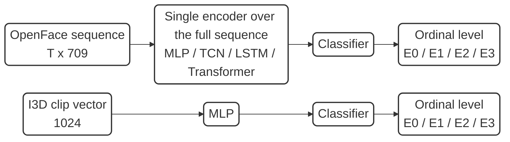

Two independent pipelines, no fusion box (the contrast with 0b). Four OpenFace baselines apply one
encoder (MLP / TCN / LSTM / Transformer) to the full 709-d sequence; the I3D baseline is an MLP on
the pooled 1024-d vector. Both MLP baselines (`openface_mlp`, `i3d_mlp`) are shown.

### 0b. Proposed hybrid overview (auxiliary heads omitted; detailed in Diagram 2a / Figure 3.4)

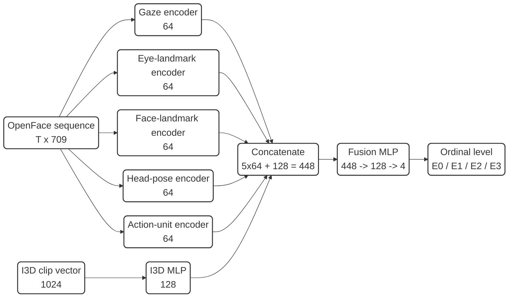

I3D-stream-disabled variant: drop the I3D row, so the concatenation is `5 x 64 = 320` and the fusion
MLP is `320 -> 128 -> 4`.

---

## Diagram 1 — Baseline (single-encoder) architectures

### 1a. OpenFace baselines (one encoder over the full `T x 709` sequence)

`openface_mlp`
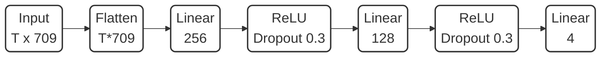

`openface_tcn` (temporal_cnn)
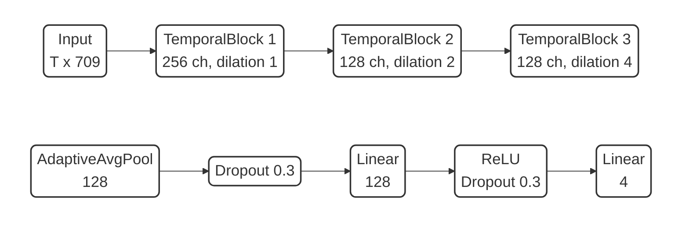
`openface_tcn(subgraph)`
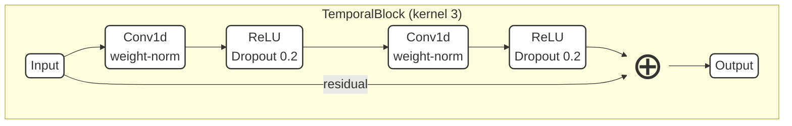

`openface_lstm`
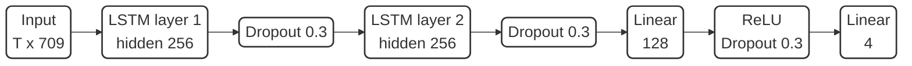

`openface_lstm(subgraph)` — one LSTM cell, unrolled per timestep `t`
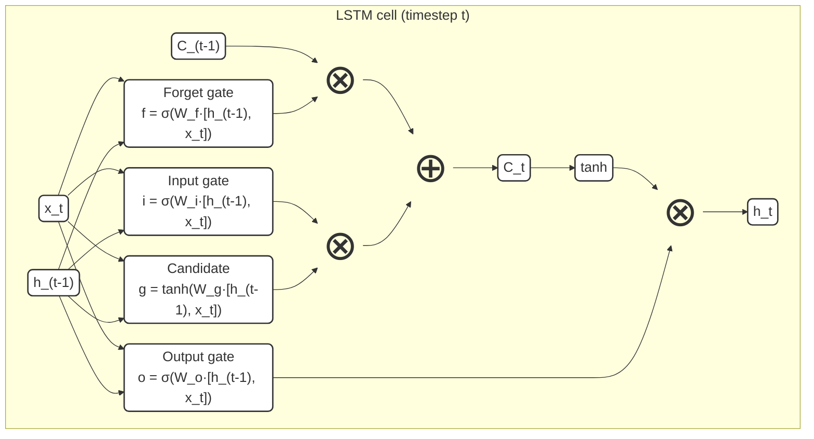

`openface_transformer`
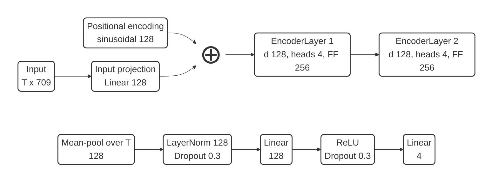

`openface_transformer(subgraph)` — one encoder layer (post-norm)
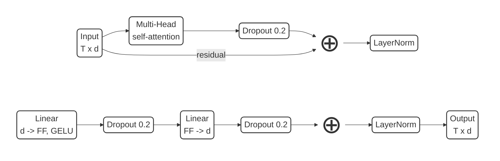

### 1b. I3D baseline (`i3d_mlp`) — MLP on the 1024-d clip vector

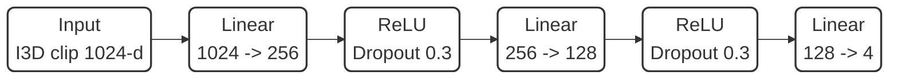

---

## Diagram 2 — Feature-group hybrid architecture

Each OpenFace group and the I3D stream is encoded independently into a 64-d embedding; the six
embeddings are concatenated and classified by a shared MLP; each stream also feeds an auxiliary
head. OpenFace-only variant: drop the I3D row, so the concatenation is `5 x 64 = 320` and the
fusion MLP is `320 -> 128 -> 4`.

### 2a. Overall data flow

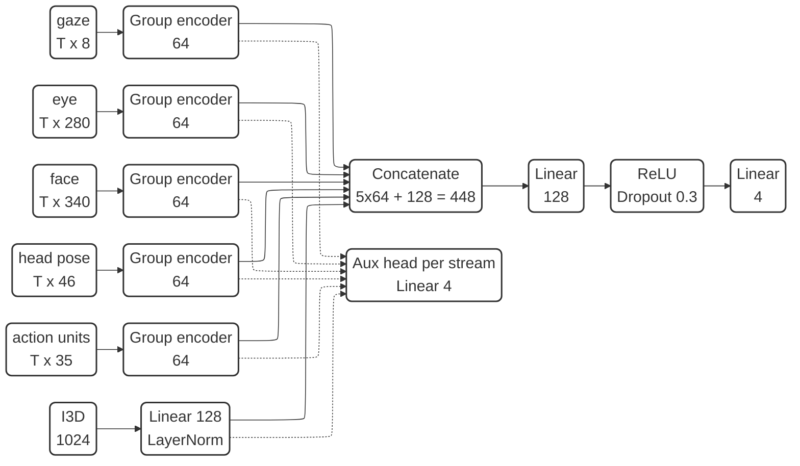

Total loss = main cross-entropy + `0.2 * mean(aux cross-entropy over the six streams)`.

### 2b. Group encoder options (each maps `T x D_group` to a 64-d embedding)

A group's encoder is one of these three; `D_group` is that group's width (8 / 280 / 340 / 46 / 35).

Option A: TCN
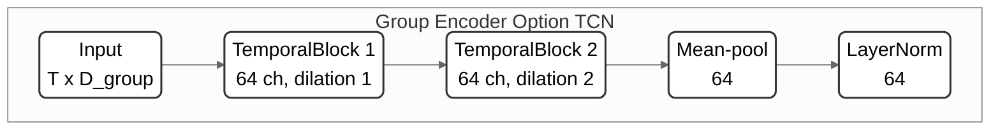

Option B: Transformer (encoder-layer internals in `openface_transformer(subgraph)`, with `d = 64`, `FF = 128`)
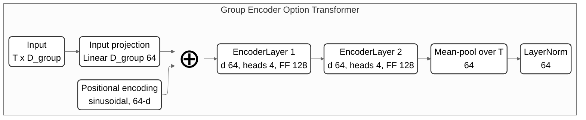

Option C: LSTM (cell internals in `openface_lstm(subgraph)`, with hidden `64`)
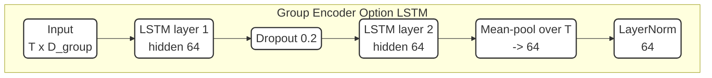

> TemporalBlock internals (shared by 1a/2b TCNs): `Conv1d (weight-norm) -> ReLU -> Dropout 0.2`
> twice, with a residual connection; kernel 3 throughout. See the detail subgraph in `openface_tcn`.
>
> LSTM/Transformer internals are shared across 1a and 2b — only widths differ (baseline:
> hidden 256 / `d=128`, `FF=256`; group encoder: hidden 64 / `d=64`, `FF=128`). The group LSTM
> mean-pools its per-timestep outputs (the baseline instead takes the last hidden state `h_T`).
